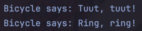

# Guided Lab: The Power of Inheritance

## Warren Denzel F. Cheng

## Introduction
A series of exercises that involve the use of inheritance in Java programming to explore its intracies and how it is implemented.

## Exercises
1. **BASIC INHERITANCE: THE `extends` KEYWORD**

  

- **Mini Challenge**

  

2. **ABSTRACT CLASSES: DEFINING A TEMPLATE**

  

- **Mini Challenge**

  

3. **METHOD OVERRIDING: PROVIDING A NEW IMPLEMENTATION**

  

- **Mini Challenge**

  

4. **INHERITING VARIABLES & ACCESS RULES**

  

- **Mini Challenge**

  

